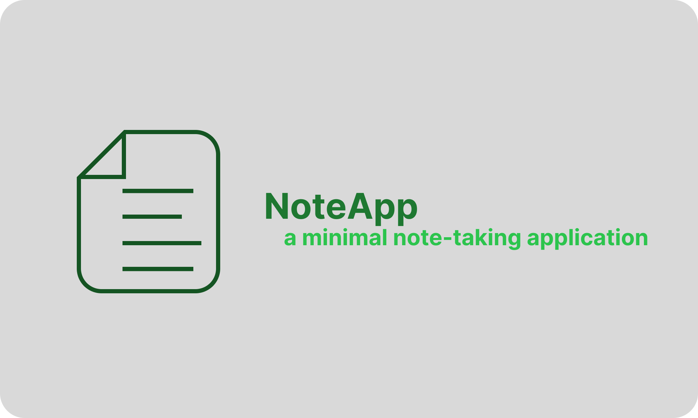

# **[📝 NoteApp](#)**


<br/>

*⚠️ This project was created as a learning exercise for an internship to build a note-taking app using React and Vite. I decided to leave it as-is when I stopped working on it ⚠️*

<br/>

NoteApp is a **simple and modern note-taking application** that lets users create, edit, and search notes quickly. It features a clean UI and leverages React for a smooth interactive experience.

<br/>

<p align="center">
  
</p>

<br/>

# 📋 Summary

* **[📋 Summary](#-summary)**
* **[📝 Features](#-features)**
* **[🛠️ Install](#%EF%B8%8F-install)**
  * [📦 Dependencies](#-dependencies)
  * [⚙️ Setup](#%EF%B8%8F-setup)
  * [🚀 Run](#-run)
* **[🙏 Credits](#-credits)**

---

## 📝 Features

- Create, edit, and delete notes
- Adding tags
- Summarize note using OpenAI API
- Add gifs using Giphy API


---

## 🛠️ Install

### 📦 Dependencies

- npm
- React
- Vite
- Amplify
- Antd

### ⚙️ Setup

- Add ```.env``` file with : 


```bash
OPENAI_API_KEY = <api_key>
GIPHY_API_KEY = <api_key>
```
- Then run the following command :

```bash
npm install
npm build
```

### 🚀 Run

#### Default :
```bash
npm run start
```
#### Dev :
```bash
npm run dev
```

#### Server :
```bash
npm run fstart
```
(Stop the server with ```npm run fstop```)

### 🙏 Credits
- Developed by Noa Petel


